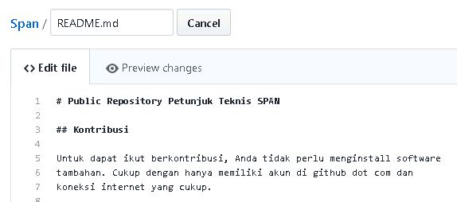
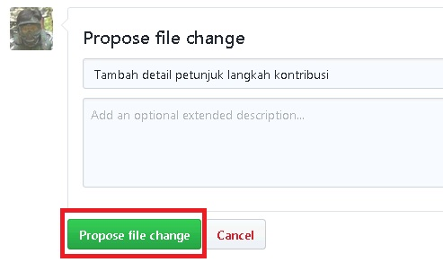
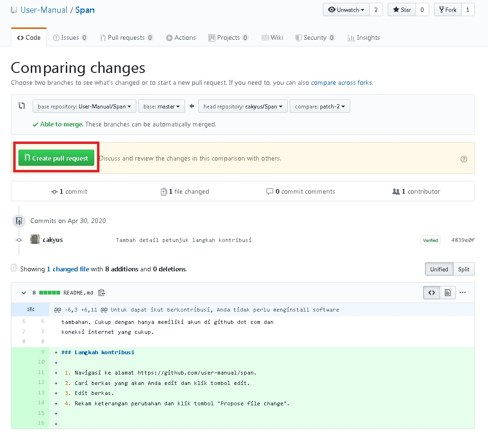
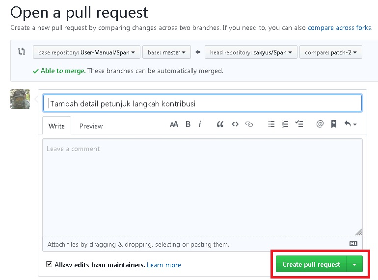
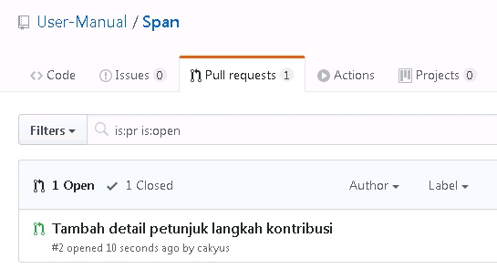
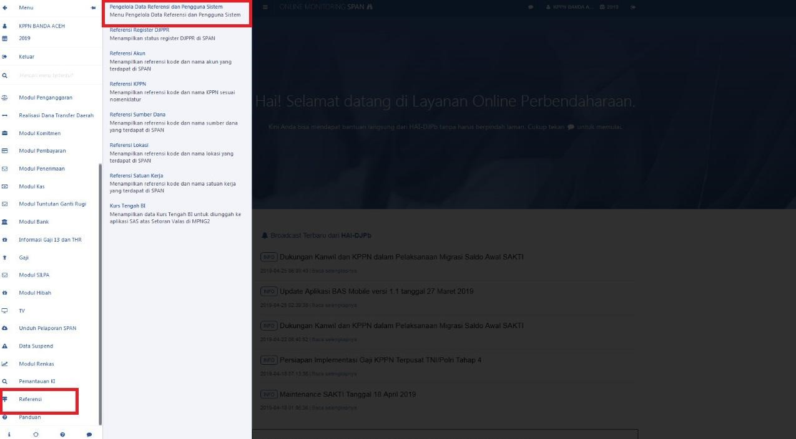
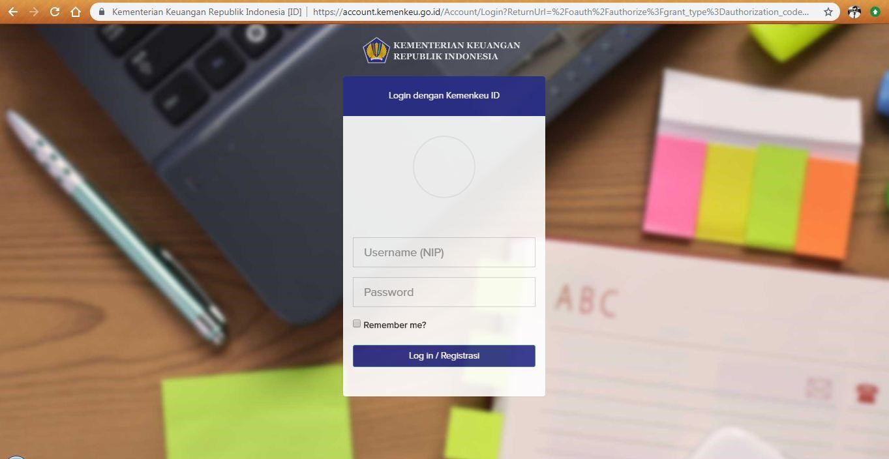

# Public Repository Petunjuk Teknis SPAN

Repository petunjuk teknis SPAN yang untuk sementara dikelola
oleh cakyus at gmail dot com.

## Kontribusi

Untuk dapat ikut berkontribusi, Anda nggak perlu install software
tambahan. Kami juga ogah ribet. Cukup dengan hanya memiliki
akun di github dot com dan koneksi internet.

### Langkah kontribusi

 1. Navigasi ke alamat https://github.com/user-manual/span
 2. Cari berkas yang akan Anda edit dan klik tombol edit.  
    
 3. Edit berkas.  
    
 4. Rekam keterangan perubahan dan klik tombol "Propose file change".  
    
 5. Review perubahan yang akan Anda ajukan kemudian tekan tombol "Create pull request".  
    
 6. Kirim perubahan dengan menekan tekan tombol "Create pull request".  
    
 7. Pada repository akan terlihat pull request yang Anda ajukan.  
    
 8. Selesai.
 
Selanjutnya collaborator akan melakukan review terhadap
pull request yang Anda ajukan.

Petunjuk Teknis Permintaan Update Data Kepegawaian Melalui Aplikasi OMSPAN  

1.	Login  

    a.	Buka browser dan masuk ke alamat web OMSPAN :  
https://spanint.kemenkeu.go.id/
    
    b.	User kemudian masuk menggunakan user dan password OMSPAN level KPPN untuk mengakses halaman utama OMSPAN. Kemudian klik Menu  Referensi  Pengelola Data Referensi dan Pengguna Sistem.  

    c.	Selanjutnya User Login ke Aplikasi dengan meng-klik tombol Login yang terdapat di sebelah kanan atas. User mengisi username dan password sebagaimana aplikasi e-performance.  
  

User telah login sebagai UM_USER.
2.	Menu Permintaan Updaet Data Kepegawaian  
    a.	Setelah berhasil login, maka user dapat mengirimkan permintaan update data kepegawaian melalui panel menu sebagai berikut :  
  

    b.	User kemudian mengetikkan data NIP pegawai yang akan diupdate pada form yang ada pada menu tersebut dan klik “kirim” :  

