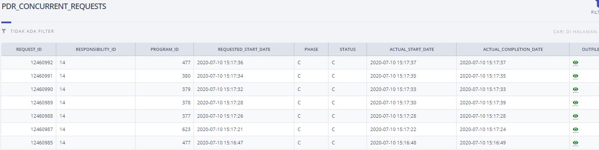

# Sinkronisasi Data HRIS Mandiri  

1.	Login dengan responsibility UM_USER.  

2.	Klik menu Permintaan Update Data Kepegawaian    
  

3.	Klik “KIRIM” :  

4. Tunggu hingga status request menjadi "C C"  

