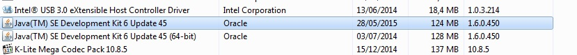

Petunjuk Teknis Permintaan Update Data Kepegawaian Melalui Aplikasi OMSPAN

1.	Login
a.	Buka browser dan masuk ke alamat web OMSPAN : 
	https://spanint.kemenkeu.go.id/
  
b.	User kemudian masuk menggunakan user dan password OMSPAN level KPPN untuk mengakses halaman utama OMSPAN. Kemudian klik Menu  Referensi  Pengelola Data Referensi dan Pengguna Sistem.

 

c.	Selanjutnya User Login ke Aplikasi dengan meng-klik tombol Login yang terdapat di sebelah kanan atas. User mengisi username dan password sebagaimana aplikasi e-performance.
 
User telah login sebagai UM_USER.
2.	Menu Permintaan Updaet Data Kepegawaian
a.	Setelah berhasil login, maka user dapat mengirimkan permintaan update data kepegawaian melalui panel menu sebagai berikut :
 

b.	User kemudian mengetikkan data NIP pegawai yang akan diupdate pada form yang ada pada menu tersebut dan klik “kirim” :
 
c.	
